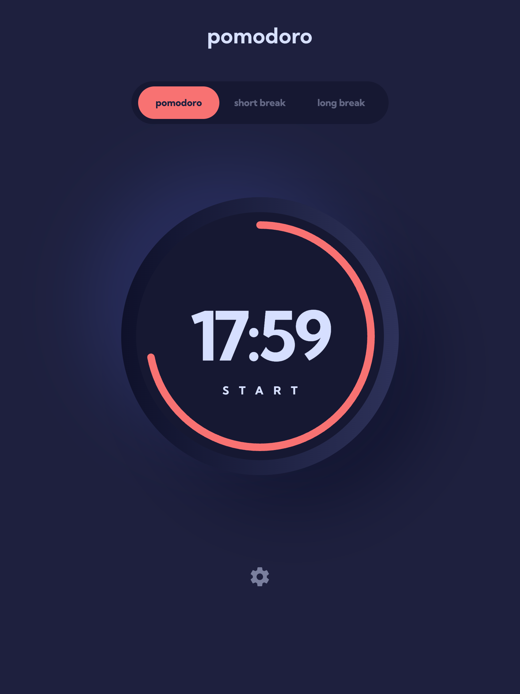
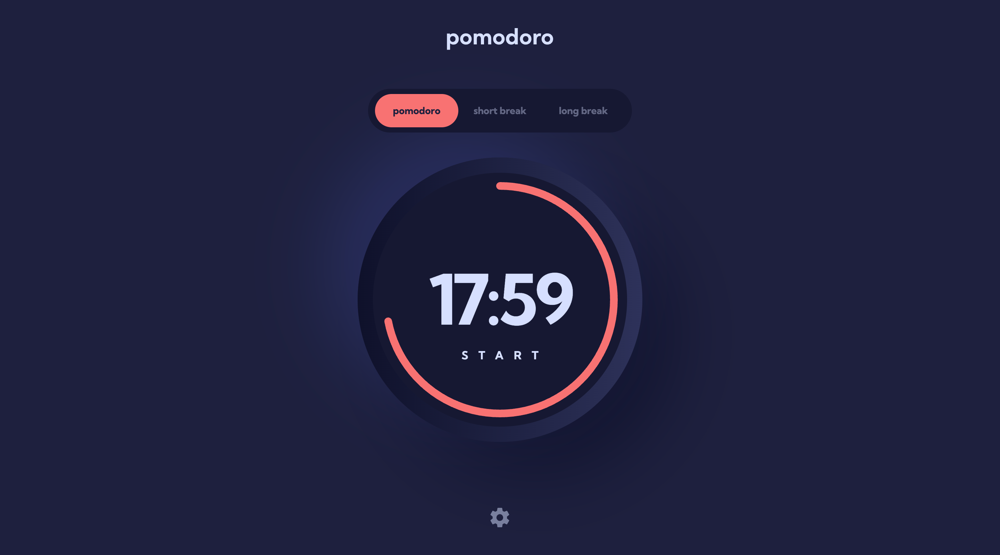
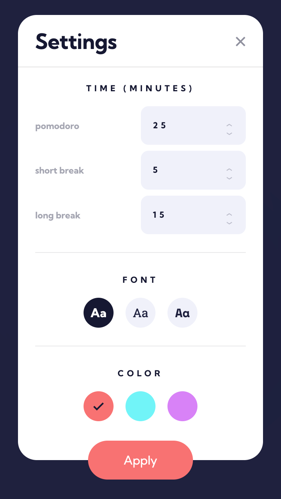
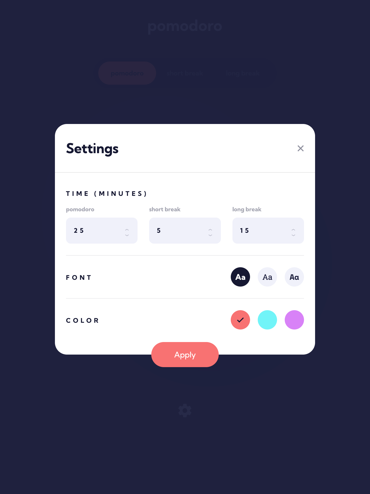
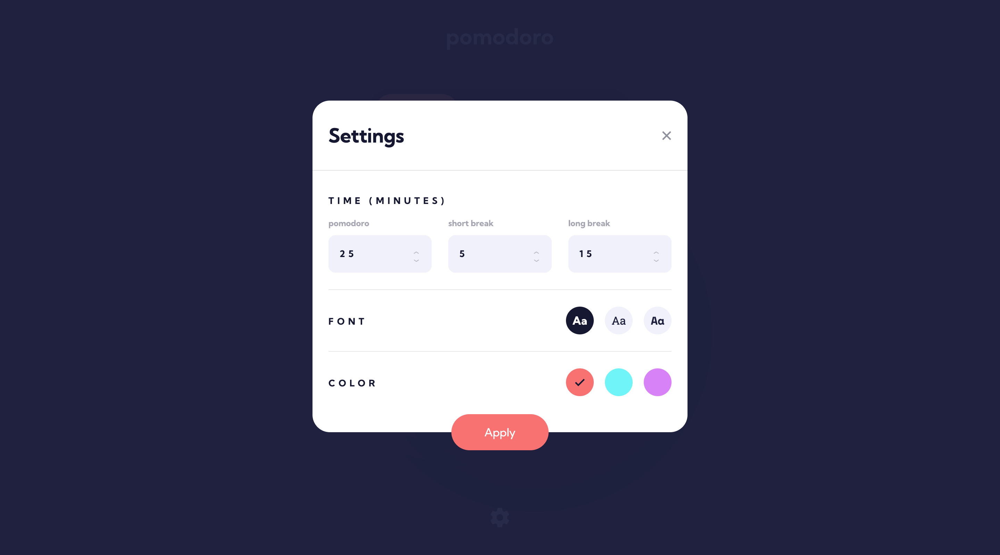

# Frontend Mentor - Pomodoro app solution

This is a solution to the [Pomodoro app challenge on Frontend Mentor](https://www.frontendmentor.io/challenges/pomodoro-app-KBFnycJ6G). Frontend Mentor challenges help you improve your coding skills by building realistic projects.

## Table of contents

- [Overview](#overview)
  - [The challenge](#the-challenge)
  - [Screenshots](#screenshots)
  - [Links](#links)
- [My process](#my-process)
  - [Built with](#built-with)
  - [What I learned](#what-i-learned)
  - [Continued development](#continued-development)
  - [Useful resources](#useful-resources)
- [Author](#author)

## Overview

### The challenge

Users should be able to:

- Set a pomodoro timer and short & long break timers
- Customize how long each timer runs for
- See a circular progress bar that updates every minute and represents how far through their timer they are
- Customize the appearance of the app with the ability to set preferences for colors and fonts

### Screenshots

|               Mobile designed at 375px:                |               Tablet designed at 1440px:               | Desktop designed at 1440px:                             |
| :----------------------------------------------------: | :----------------------------------------------------: | ------------------------------------------------------- |
|  |  |  |
|       |       |       |

### Links

- Solution URL: [https://github.com/elisilk/pomodoro-app](https://github.com/elisilk/pomodoro-app)
- Live Site URL: [https://elisilk.github.io/pomodoro-app/](https://elisilk.github.io/pomodoro-app/)

## My process

### Built with

- Semantic HTML5 markup
- CSS custom properties
- Flexbox
- CSS Grid
- Mobile-first workflow
- Accessibility
- Web Components
- Local storage

### What I learned

As always, so many cool :sunglasses: things. Here are some of the key resources I used:

- [Pomodoro Technique](https://en.wikipedia.org/wiki/Pomodoro_Technique) and Examples
  - [Pomofocus](https://pomofocus.io/)
  - [Pomodor](https://pomodor.app/timer)
  - [studywithme.io](https://studywithme.io/aesthetic-pomodoro-timer/)
- Circular progres bar + countdown timer together
  - [SVG circle progress bar](https://nikitahl.com/svg-circle-progress) and associated [SVG circle progress generator](https://nikitahl.github.io/svg-circle-progress-generator/)
  - [Front-End challenge: progress indicator](https://piccalil.li/blog/challenge-009-progress-indicator/) and [solution](https://piccalil.li/blog/solution-009-progress-indicator/) with [associated codepen](https://codepen.io/piccalilli/pen/mdogpWK). I have to look into this [Front-End Challenges Club](https://piccalil.li/category/front-end-challenges-club/) more!
  - [Create an animated, circular progress bar](https://www.youtube.com/watch?v=MXWP56LUI3g&ab_channel=KevinPowell) - Kevin Powell's solution to the same frontend challenge and [associated codepen](https://codepen.io/kevinpowell/pen/YzgmRLo)
- Circular progress bar
  - [`<progress>`: The Progress Indicator element](https://developer.mozilla.org/en-US/docs/Web/HTML/Reference/Elements/progress)
  - [ARIA: progressbar role](https://developer.mozilla.org/en-US/docs/Web/Accessibility/ARIA/Reference/Roles/progressbar_role)
  - [How to style a progress bar using CSS](https://verpex.com/blog/website-tips/how-to-style-a-progress-bar-using-css) - And the [associated CodePen](https://codepen.io/t_afif/pen/XWZazmy?editors=1100). A great start, although I ultimately went a different direction
- Countdown timers
  - [How to Create an Animated Countdown Timer With HTML, CSS and JavaScript](https://css-tricks.com/how-to-create-an-animated-countdown-timer-with-html-css-and-javascript/)
  - [Build a Countdown Timer in Just 18 Lines of JavaScript](https://www.sitepoint.com/build-javascript-countdown-timer-no-dependencies/)
- Radio button 3-option switches that are accessible
  - [3 State Switches are not tough - Ultimate guide to CSS Switches using CSS only](https://dev.to/navdeepm20/3-state-switches-are-not-tough-ultimate-guide-to-css-switches-using-css-only-1gja)
  - [Inclusively Hiding & Styling Checkboxes and Radio Buttons](https://www.sarasoueidan.com/blog/inclusively-hiding-and-styling-checkboxes-and-radio-buttons/)
  - [USWDS Radio buttons](https://designsystem.digital.gov/components/radio-buttons/)
- [How to determine the equivalent opaque RGB color for a given partially transparent RGB color against a white background](https://graphicdesign.stackexchange.com/questions/113007/how-to-determine-the-equivalent-opaque-rgb-color-for-a-given-partially-transpare)
- [`<input type="number">`](https://developer.mozilla.org/en-US/docs/Web/HTML/Reference/Elements/input/number)
  - [Styling an input type=number](https://stackoverflow.com/questions/26024771/styling-an-input-type-number)
- SVGs
  - [URL-encoder for SVG](https://yoksel.github.io/url-encoder/)
  - [Is there a way to use SVG as content in a pseudo element ::before or ::after](https://stackoverflow.com/questions/19255296/is-there-a-way-to-use-svg-as-content-in-a-pseudo-element-before-or-after)
  - [Using SVG](https://css-tricks.com/using-svg/)
  - [SVG Viewport and viewBox (For Complete Beginners)](https://webdesign.tutsplus.com/svg-viewport-and-viewbox-for-beginners--cms-30844t)
  - [Making SVGs Responsive with CSS](https://tympanus.net/codrops/2014/08/19/making-svgs-responsive-with-css/)
  - [How to Scale SVG](https://css-tricks.com/scale-svg/)
  - [Responsive SVGs: Stretch your knowledge of working with SVGs for scalable, responsive experiences](https://12daysofweb.dev/2023/responsive-svgs/)
  - [SVG and CSS](https://developer.mozilla.org/en-US/docs/Web/SVG/Tutorials/SVG_from_scratch/SVG_and_CSS)
  - [Everything You Need To Know About SVG](https://css-tricks.com/lodge/svg/) - especially episode [15 SVG Icon System – Where the defs go](https://css-tricks.com/lodge/svg/15-svg-icon-system-defs-go/)
  - [SVG to Base64 & Data URI encoder](https://www.fffuel.co/eeencode/)
- [Delay, Sleep, Pause & Wait in JavaScript](https://www.sitepoint.com/delay-sleep-pause-wait/)
  - [How to Make JavaScript Wait for 1 Second: Using setTimeout and Promises?](https://www.browserstack.com/guide/javascript-wait-one-second)
- [Set an Attribute Without Value in JavaScript](https://8hob.io/posts/set-attribute-without-value-in-js/)
- [Function.prototype.bind()](https://developer.mozilla.org/en-US/docs/Web/JavaScript/Reference/Global_Objects/Function/bind)
  - [Bind event listener and keep element as this](https://stackoverflow.com/questions/56514245/bind-event-listener-and-keep-element-as-this)
- [Web Components](https://developer.mozilla.org/en-US/docs/Web/API/Web_components)
  - [Using custom elements](https://developer.mozilla.org/en-US/docs/Web/API/Web_components/Using_custom_elements)
  - [web-components-examples](https://github.com/mdn/web-components-examples)
  - [https://developer.mozilla.org/en-US/docs/Web/API/CustomStateSet](https://developer.mozilla.org/en-US/docs/Web/API/CustomStateSet)
  - [Making Web Component properties behave closer to the platform](https://blog.ltgt.net/web-component-properties/)
- [`<time>`: The (Date) Time element](https://developer.mozilla.org/en-US/docs/Web/HTML/Reference/Elements/time) - especially a time duration
  - [valid duration string](https://html.spec.whatwg.org/multipage/common-microsyntaxes.html#valid-duration-string)
  - [Converting string time into milliseconds](https://stackoverflow.com/questions/15191184/converting-string-time-into-milliseconds)
- [`<dialog>`: The Dialog element](https://developer.mozilla.org/en-US/docs/Web/HTML/Reference/Elements/dialog)
  - [Basic Dialog Usage and Gotchas To Watch For](https://frontendmasters.com/blog/basic-dialog-usage-and-gotchas-to-watch-for/)
  - [Scroll-Locked Dialogs](https://frontendmasters.com/blog/scroll-locked-dialogs/)
  - [How to stop page scrolling when you have an open dialog element](https://chipcullen.com/how-to-stop-page-scrolling-with-open-dialog/)
  - [Is `<dialog>` enough?](https://blog.mayank.co/is-dialog-enough)
  - [A look at the dialog element's super powers](https://www.stefanjudis.com/blog/a-look-at-the-dialog-elements-super-powers/)
  - [How to target ::backdrop in Javascript to close modal?](https://stackoverflow.com/questions/77687043/how-to-target-backdrop-in-javascript-to-close-modal)
- [`<fieldset>`: The Field Set element](https://developer.mozilla.org/en-US/docs/Web/HTML/Reference/Elements/fieldset)
- [Container Query Units and Fluid Typography](https://moderncss.dev/container-query-units-and-fluid-typography/)
- [CSS container queries](https://developer.mozilla.org/en-US/docs/Web/CSS/CSS_containment/Container_queries)
  - [Using CSS containment](https://developer.mozilla.org/en-US/docs/Web/CSS/CSS_containment/Using_CSS_containment)
  - [A Friendly Introduction to Container Queries](https://www.joshwcomeau.com/css/container-queries-introduction/)
  - [Container Queries Unleashed](https://www.joshwcomeau.com/css/container-queries-unleashed/)
  - [Solved By Modern CSS: Feature Image](https://ishadeed.com/article/modern-css-feature-image/)
- [Using CSS custom properties (variables)](https://developer.mozilla.org/en-US/docs/Web/CSS/CSS_cascading_variables/Using_CSS_custom_properties)
  - [CSS Color Architecture](https://medium.com/appwrite-io/css-color-architecture-ca5de26f2df7)
  - [What do you name color variables?](https://css-tricks.com/what-do-you-name-color-variables/)
  - [How we’re approaching theming with modern CSS](https://piccalil.li/blog/how-were-approaching-theming-with-modern-css/)
  - [Tutorial: Creating a Dark Theme using CSS Custom Properties](https://www.scale.at/blog/css-custom-properties) and [associated Codepen](https://codepen.io/lara_amalia/pen/JjrGmXr)
  - [Using CSS custom properties like this is a waste](https://www.youtube.com/watch?v=_2LwjfYc1x8&ab_channel=KevinPowell) and [associated Codepen](https://codepen.io/kevinpowell/pen/RwEqEyV)
  - [Custom properties with defaults: 3+1 strategies](https://lea.verou.me/blog/2021/10/custom-properties-with-defaults/)
  - [`prefers-color-scheme`](https://developer.mozilla.org/en-US/docs/Web/CSS/@media/prefers-color-scheme)
  - [The Perfect Theme Switch Component](https://www.aleksandrhovhannisyan.com/blog/the-perfect-theme-switch/)
- [Use the child-element count in CSS](https://crinkles.dev/writing/use-the-child-element-count-in-css/)

### Continued development

Specific areas that the solution should be improved (known issues):

- [ ] Right click menu keeps popping up when clicking into focus the numeric input items on the settings dialog when in the Chrome developer tools responsive mode
- [ ] Do more error checking on the numeric input elements (needs to be an integer value greater than 0)
- [ ] Some kind of indicator that a timer has completed successfully (e.g., buzzing or an icon)
- [ ] Keep track of where in the sequence the user is (e.g., task #3 out of 4)
- [ ] Provide a plain language update of the status (how much time is left, how much total time in this segment, what kind of segment is currently on)
  - [ ] Use the [`aria-valuenow`](https://developer.mozilla.org/en-US/docs/Web/Accessibility/ARIA/Reference/Attributes/aria-valuenow) and [`aria-valuetext`](https://developer.mozilla.org/en-US/docs/Web/Accessibility/ARIA/Reference/Attributes/aria-valuetext) attributes
  - [ ] Update the status in the document title too
- [ ] When viewport is less than 375px (mobile size), then some of the spacing starts to get a bit off. Should be able to accommodate a screen as little as 320px wide. In particular, pay attention such as:
  - [x] margin-block-start for the text within the countdown clock (could go down to 70px, or less)
  - [x] font-size of the countdown clock timer (could go down to 70px, or less)
  - the font size and/or the spacing/line breaks for the top tabs
  - the issues are especially pronounced with the monospace font
- [ ] Remove the little shifting that occurs as the time text counts down and the inline spacing of the numbers changes for different digits
- [x] Remove the letter spacing at the end of the start/restart/pause button that makes it seem like the text is not centered properly

More general ideas I want to consider:

Hmm 🤔 ...

- Consider doing more of Piccalilli's [Front-End Challenges Club](https://piccalil.li/category/front-end-challenges-club/)!

### Useful resources

- [Kevin Powell on YouTube](https://www.youtube.com/@KevinPowell) - He's the best.
- [Accessibility Developer Guide](https://www.accessibility-developer-guide.com/)
- [MDN Web Docs for CSS](https://developer.mozilla.org/en-US/docs/Web/CSS) - Went here a lot to reference the different CSS properties and the shorthands, and all the great explanations about best practices.
- [The Clamp Calculator](https://royalfig.github.io/fluid-typography-calculator/) - Used for all of fluid typography and fluid spacing calculations. I didn't end up using it in this solution, but it's always there when I need it.

## Author

- Website - [Eli Silk](https://github.com/elisilk)
- Frontend Mentor - [@elisilk](https://www.frontendmentor.io/profile/elisilk)
